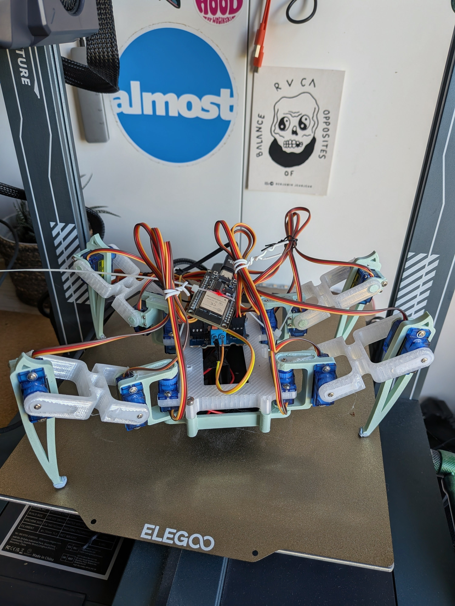

# **ESP32-Rust Quadruped Spider Robot**

<div align="center">
  
</div>

This repository contains the firmware for a 3D-printable, Wi-Fi controlled quadruped (spider) robot. The robot is powered by an ESP32 microcontroller, and the firmware is written entirely in Rust using the Embassy asynchronous framework for predictable, real-time performance.

The project draws heavy inspiration from the [DIY Spider Robot](https://www.instructables.com/DIY-Spider-RobotQuad-robot-Quadruped/) on Instructables while modernising the software stack with Rust.

## Table of Contents

1. [Introduction](#introduction)
2. [Hardware](#hardware)
   1. [Bill of Materials](#bill-of-materials)
   2. [Wiring Diagram](#wiring-diagram)
3. [Software Design](#software-design)
   1. [Architecture Overview](#architecture-overview)
   2. [Why a PCA9685 Servo Driver?](#why-a-pca9685-servo-driver)
4. [Build It Yourself](#build-it-yourself)
   1. [Assembly](#assembly)
   2. [Wiring](#wiring)
   3. [Flashing the Firmware](#flashing-the-firmware)
   4. [Controlling the Robot](#controlling-the-robot)
5. [Troubleshooting](#troubleshooting)
6. [Contributing](#contributing)

## Introduction

This project aims to provide an accessible yet advanced robotic platform. By combining the Wi-Fi-enabled ESP32 with the safety and concurrency guarantees of Rust, the robot can execute complex movements while remaining resilient to runtime errors. The quadruped has 12 degrees of freedom (three per leg) and uses inverse kinematics to calculate the joint angles required to position its feet in 3D space.

Remote control is handled over Wi-Fi through a lightweight TCP server running on the ESP32, allowing you to send commands from any computer on the same network.

## Hardware

### Bill of Materials

| Component | Quantity | Notes |
| :---- | :---- | :---- |
| ESP32 DevKitC (or similar) | 1 | The main microcontroller. |
| PCA9685 16-Channel Servo Driver | 1 | Controls all servos over I2C. Essential for synchronous movement. |
| SG90 Micro Servos | 12 | One for each joint of the robot's four legs. |
| 5V Power Supply | 1 | A stable power source capable of at least 3A (e.g., LiPo + buck converter or wall adapter). |
| 3D Printed Robot Chassis | 1 | STL files are available in the original [Instructables guide](https://www.instructables.com/DIY-Spider-RobotQuad-robot-Quadruped/). |
| Jumper Wires | Various | For connecting the components. |

### Wiring

#### ESP32 Connections

You must power the servos separately from the ESP32. The ESP32's onboard regulator cannot supply the high current the 12 servos require.

| ESP32 Pin | Connects to |
| :---- | :---- |
| GND | PCA9685 GND |
| 3v3 | PCA9685 VCC |
| GPIO22 | PCA9685 SCL |
| GPIO21 | PCA9685 SDA |

#### Power Connections

* Connect your **5V 3A+ power supply** + terminal to the V+ terminal on the PCA9685. This powers the servos.
* Connect the power supply - terminal to the GND terminal on the PCA9685.
* **Important:** Ensure the ESP32's GND is also connected to the power supply's GND to create a common ground reference. Do not power the servos from the esp32 and use a dedicated power supply!!

#### Servo Connections

* Plug the 12 servos into the PCA9685 channels as defined below. Each servo has three wires: GND (brown), V+ (red), and signal (orange).
* The servo channels are assigned in arrays, with the required joint order being \[Femur, Tibia, Coxa\].

| Leg | PCA9685 Channels |
| :---- | :---- |
| Front Left | \[C15, C14, C13\] |
| Rear Left | \[C12, C11, C10\] |
| Front Right | \[C0, C1, C2\] |
| Rear Right | \[C3, C4, C5\] |

## Software Design

The firmware is written in Rust and built upon the Embassy asynchronous framework. This allows for clean, non-blocking management of networking, motion planning, and low-level motor control simultaneously.

### Architecture Overview

The software is divided into three primary asynchronous tasks:

1. **net_task:**
   * Connects the ESP32 to your local Wi-Fi network.
   * Starts a TCP server on port 1234.
   * Listens for incoming string-based commands (e.g., `sf 4`).
   * Parses these commands and sends them to the `gait_task` for execution.
2. **gait_task:**
   * The "brain" of the robot. It receives high-level commands from the `net_task`.
   * Uses a `GaitEngine` state machine to translate simple commands into a sequence of precise leg movements.
   * Calculates the target Cartesian coordinates (X, Y, Z) for each leg's endpoint.
   * Sends this position data to the `servo_task`.
3. **servo_task:**
   * Directly interfaces with the hardware.
   * Receives target coordinates and movement speeds from the `gait_task`.
   * Performs **inverse kinematics** calculations (see `conversion.rs`) to convert the (X, Y, Z) coordinates into the three required servo angles (alpha, beta, gamma) for each leg.
   * Interpolates the servo positions from their current state to the target state, using a step preventing jerky movements.
   * Communicates with the PCA9685 driver over I2C to set the final PWM signals for each servo.

The original project relied heavily on global shared state, which made it difficult to reason about ownership and mutation. This implementation tries to keep ownership clear: the `gait_task` manages the robot pose, and the `servo_task` focuses solely on driving PWM signals.

### Why a PCA9685 Servo Driver?

While the ESP32 has a built-in PWM generator (`ledc`), it's not ideal for robotics applications requiring synchronised multi-joint movement (I learned it the hard way...). The 16 ledc channels can not share one single timer, and having the timer in sync is a non trivial task.  When you command a leg to move, its three servos need to start and stop turning at *precisely* the same time for smooth, coordinated motion.

The **PCA9685** solves this problem. It's a dedicated I2C PWM driver that allows you to update the pulse width for all 16 channels in a single, atomic-like operation. The firmware can calculate the positions for all 12 servos and send the update command, ensuring all servos refresh in unison. The result is the fluid, life-like motion essential for a legged robot.

ESP32 also has better suited peripherals for motor control namely `mcpwm`, or even `rmt` to synchronize ledc signals, but I couldn't really wrap my head around and was limited in time so I went for the easy solution and bought extra hardware. See those link for more informations on channels synchronization on ESP32: [mcpwm](https://docs.rs/esp-hal/latest/esp_hal/mcpwm/index.html), [rmt](https://docs.espressif.com/projects/esp-idf/en/stable/esp32/api-reference/peripherals/rmt.html).

## Build It Yourself

###  Assembly

First, 3D print and assemble the robot's chassis and legs. Follow the excellent guide provided in the original [Instructables project](https://www.instructables.com/DIY-Spider-RobotQuad-robot-Quadruped/).

### Wiring

Wire the components together according to the [wiring diagram](#wiring-diagram) section above. Double-check the polarity and connector orientation before powering anything to avoid damaging your components.

### Flashing the Firmware

**Prerequisites:**

* A working Rust environment (see [rustup.rs](https://rustup.rs/)).
* The `xtensa-esp32-elf` target installed: `rustup target add xtensa-esp32-elf`
* [`cargo-espflash`](https://github.com/esp-rs/cargo-espflash) installed for flashing: `cargo install cargo-espflash`

**Configuration:**

1. Clone this repository.
2. Rename the file `.cargo/config.toml.example` to `.cargo/config.toml`.
3. Open `.cargo/config.toml` and add your Wi-Fi credentials under the `[env]` section:

   ```toml
   [env]
   WIFI_SSID = "YourNetworkName"
   WIFI_PASS = "YourNetworkPassword"
   ```

4. Connect the ESP32 to your computer via USB.

**Build and flash:**

```bash
cargo run
```

By default this command compiles the firmware, flashes it to the connected board, and then attaches a serial monitor.

### Step 4: Controlling the Robot

1. Once flashed, the robot connects to your Wi-Fi network. The `cargo run` command opens a serial monitor where you can find the IP address that was assigned (e.g., `192.168.1.123`).
2. Control the robot by sending TCP commands to port 1234. A simple way to do this is with `netcat` (`nc`) or `telnet`.

```bash
# Tell the robot to take 2 steps forward
echo "sf 2" | nc 192.168.1.123 1234

# Tell the robot to turn left 4 times using telnet
telnet 192.168.1.123 1234
> stand
> tl 4
```

**Commands**

| Command | Description | Example |
| :------ | :---------------------------------------- | :-------- |
| `test` | Runs a pre-programmed demo sequence. | `test` |
| `stand` | Puts the robot in a standing position. | `stand` |
| `sit` | Puts the robot in a sitting/resting position. | `sit` |
| `sf` | Walks forward _N_ steps. | `sf 2` |
| `sb` | Walks backward _N_ steps. | `sb 2` |
| `tl` | Turns left on the spot for _N_ steps. | `tl 4` |
| `tr` | Turns right on the spot for _N_ steps. | `tr 4` |
| `w` | Waves one of its front legs _N_ times. | `w 3` |
| `close` | Closes the TCP connection. | `close` |

## Troubleshooting

* **Robot doesn't connect to Wi-Fi:** Double-check your SSID and password in `.cargo/config.toml`. Check the serial monitor for any error messages from the ESP32.
* **Servos are jittery or don't move:** This is almost always a power issue. Verify that your 5V supply can provide at least 3A and that the wires are thick enough. Adding a large capacitor (e.g., 1000µF) across the V+ and GND rails of the PCA9685 can help smooth out power delivery. 
* **Robot doesn't respond to commands:**
  * Confirm you have the correct IP address from the serial monitor.
  * Check your I2C wiring between the ESP32 and PCA9685.
  * **Note:** This firmware uses a non-standard I2C address of `0x7f` for the PCA9685. Most modules default to `0x40`. Check if your module has solder pads to change the address, or update the address in `main.rs`.
* **Legs move in the wrong direction:** This usually means a servo was mounted facing the wrong way during assembly. You may need to remount the servo or adjust the neutral angle offsets in software.

## Contributing

Pull requests are welcome! If you plan a significant change, please open an issue first to discuss what you would like to improve. Contributions that add new gaits, improve documentation, or expand hardware support are especially appreciated.
